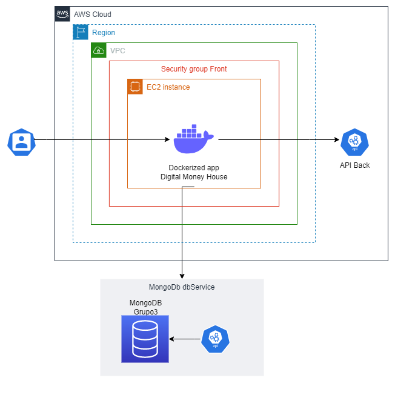

# App web Digital Money House
El desarrollo de esta aplicación web integra los conocimientos adquiridos a lo largo de la carrera Certified Tech Developer (CTD), con especial énfasis en la rama de especialización elegida: Desarrollo Front-End.
Documentaremos a lo largo del desarrollo los avaces de cada sprint, como equipo de desarrollo usaremos GitLab como 

URL de la APP: http://ec2-3-21-169-197.us-east-2.compute.amazonaws.com/ o http://3.21.169.197/

## Descripción
Digital Money House es una billetera virtual que busca facilitar y agilizar transacciones de manera accesible para todos sus usuarios: transferir dinero, recibir transferencias, pagar servicios, entre otros.

## Equipo
Grupo #3 de la Camada 1:

* Faccini, Trinidad
* Gerardi, Francisco
* Mejía, Angélica
* Santiso, Abril
* Lamberti, Santino

## Tecnologías Aplicadas
* Typescript como lenguaje de programación, incluyendo el framework de Next.js para aplicaciones web basadas en React.
* Material UI como biblioteca de componentes de React UI que implementa Material Design de Google.
* React Testing Library + Jest para test unitarios.
* Maven + Java + Selenium WebDriver para test automatizados de la suite de smoke.
 
## El Proyecto
### Sprint 1
- En este primer sprint iniciamos con la página inicial de Digital Money House, maquetando un diseño responsive recibido desde Figma (Herramienta de prototipado). En este punto del desarrollo, el usuario conocía de manera general lo que Digital Money ofrecía, podría hacer un registro de cuenta, o dado caso ya tuviese una cuenta registrada podría iniciar el login. Finalmente al ingresar a su cuenta podrá visualizar la página de home con sus iniciales en el header, con la opción de cerrar su sesión.

### Sprint 2
- En este siguiente sprint se procede con el desarrollo de algunas de las páginas del home (una vez el usuario tiene abierta su sesión): Inicio, Tu perfil y Medios de Pago(Tarjetas). El Inicio permite la visualización de un resumen de las últimas actividades del usuario, así como también su dinero disponible. En perfil podrá encontrar una información más detallada de sus datos personales y financieros, con posibilidad de editar algunos de ellos. En Tarjetas podrá gestionar medios de pago, agregar/eliminar tarjetas.

## Testing
El master test plan del proyecto se desarrolla para describir la estrategia general de testing aplicada. Se definió un estándar para testear la calidad del software, estableciendo con claridad los requisitos mínimos que deben cumplirse para su aceptación; así como también los criterios para definir defectos y casos de prueba a lo largo del desarrollo. 

- El documento se puede encontrar en el siguiente enlace:
https://docs.google.com/document/d/1AY_NpS4PT2vsY5ewnbWqCqYwjU5wri3olGtyRUJkzig/edit
- Plantilla de casos de prueba y suites:
https://docs.google.com/spreadsheets/d/1VC-GHF70-BG1UB2v0ry9XlzZLBLoAtTh1Le2ThGMobU/edit#gid=186681769

### Testing Manual
Los casos de prueba realizados cubren las funcionalidades básicas de la aplicación, tales como el correcto comportamiento responsive en el renderizado de componentes, el redireccionamiento correcto de los enlaces, validaciones de inputs, manejo de errores, entre los más destacados

### Testing Automatizado
Los casos de prueba seleccionados para automatizar son aquellos clasificados en la suite de humo, dado que componen el flujo básico y crítico del sistema. 

## Infraestructura

